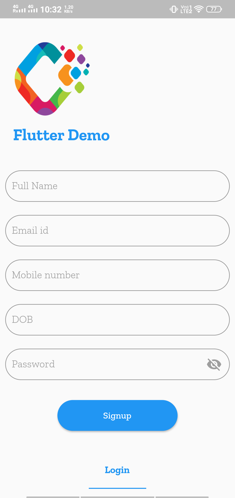

# Flutter Demo

This repository help in learning flutter. it is very help for those who want to start flutter.

In this repo we cover all the basic topic which are require to work on flutter.

## Cover Feature

1) Basic Widgets like :
  
    * Text
    * Rich Text
    * Raised Button
    * Floating Button
    * Material Button
    * Round, Stadium, Outline, Circle Button
    * Text Field
    * Form
    * Image View
    * Circle, Image.network, FadeInImage, Local assets Image
    * Progress bar
    * Custom Rating bar
    * Drop Down
    * Checkbox
    * Radio Button
    
            

    
2) Android Date Time picker
3) iOS Date Time Picker
4) Popup Menu
5) Login Screen with logo animation
6) Local Json File Read
7) Chat message type of View
8) Basic calculator
9) List VIew
10) List View With pagination
11) Api Calling with help :
    * HTTP
    * DIO
12) GitHub Api call 
    * Get git all users list
    * Details of users
    
            
    
    
13) Navigation drawer
14) Both Side Navigation Drawer (Open from left and right)
15) Stepper(Horizontal and Vertical)
16) Bottom Navigation bar
17) Tab Bar
18) SQFLITE All CRUD by creating login Signup Screen
    * ADD
    * DELETE
    * UPDATE
    * DELETE table
        
            
            
    
19) Generic Shared Preference
20) OnBoarding Screen
21) Splash animation
22) Run Time Permission

Beautiful UI design
https://github.com/lohanidamodar/flutter_ui_challenges
https://github.com/basarozcan/awesome-flutter
https://github.com/Solido/awesome-flutter
https://github.com/avirias/awesome-flutter
https://github.com/avirias/flutter_ui_challenges
https://github.com/avirias/Flutter-UI-Kit
https://github.com/leisim/awesome-flutter-packages
https://github.com/mitesh77/Best-Flutter-UI-Templates
https://github.com/basarozcan/awesome-flutter
https://github.com/kalismeras61/flutter_awesome_design_pages
https://github.com/pacifio/flutter_apps

