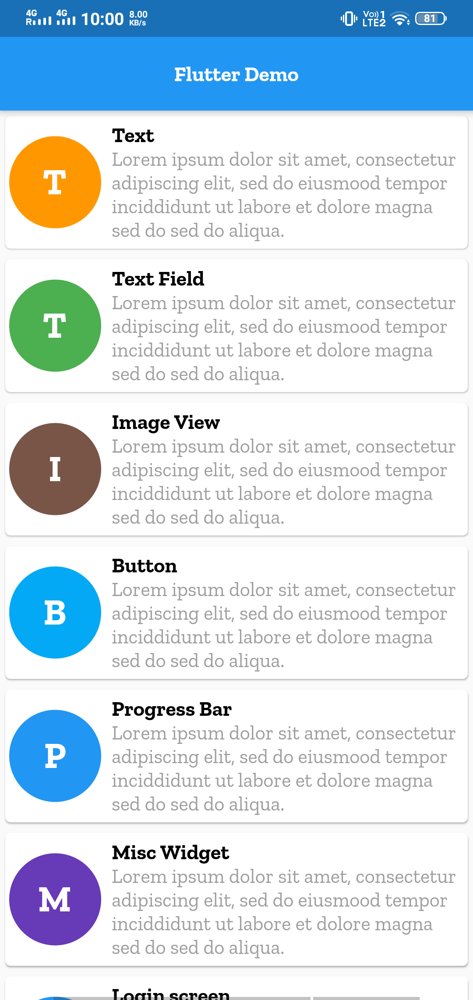
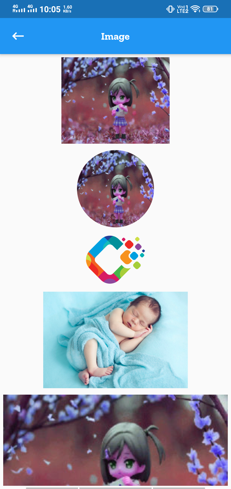

# Flutter Demo

[](LICENSE)
[](http://androidweekly.net/issues/issue-406)


This repository help in learning flutter. it is very help for those who want to start flutter.

In this repo we cover all the basic topic which are require to work on flutter.

## APK

***You can Install and test latest Flutter Demo app from below 👇***

[](https://github.com/webaddicted/Flutter-Demo/tree/master/apk/FlutterDemo.apk)


## Cover Feature


1) Basic Widgets like :
  
    * Text
    * Rich Text
    * Raised Button
    * Floating Button
    * Material Button
    * Round, Stadium, Outline, Circle Button
    * Text Field
    * Form
    * Image View
    * Circle, Image.network, FadeInImage, Local assets Image
    * Progress bar
    * Custom Rating bar
    * Drop Down
    * Checkbox
    * Radio Button
    
            


    
2) Android Date Time picker
3) iOS Date Time Picker
4) Popup Menu
5) Login Screen with logo animation
6) Local Json File Read
7) Chat message type of View
8) Basic calculator
9) List VIew
10) List View With pagination
11) Api Calling with help :
    * HTTP
    * DIO
12) GitHub Api call 
    * Get git all users list
    * Details of users
    
            
    
    
13) Navigation drawer
14) Both Side Navigation Drawer (Open from left and right)
15) Stepper(Horizontal and Vertical)
16) Bottom Navigation bar
17) Tab Bar
18) SQFLITE All CRUD by creating login Signup Screen
    * ADD
    * DELETE
    * UPDATE
    * DELETE table
        
            
            
    
19) Generic Shared Preference
20) OnBoarding Screen
21) Splash animation
22) Run Time Permission
23) Firebase : 
    * Google Login
    * Facebook Login
    * Twitter Login
    * Phone Auth
    * Cloud Firestore Database(Signup/Login)
    * Realtime Database
    * Firebase Storage
    * Firbase Push Notification

            
            

24) Swipe to delete
25) Bottom Sheet
26) Dragable bottom sheet
27) Image Picker
28) Dialog(Normal/Custom)
29) Google map
30) Signature
31) Webview
32) Collapse toolbar 
33) Video Player
34) Barcode scanner
35) Download File
36) Local Notification

## Beautiful UI design
  * [UI](https://github.com/lohanidamodar/flutter_ui_challenges)
  * [Awesome Flutter UI](https://github.com/basarozcan/awesome-flutter)
  * [Flutter Design](https://github.com/Solido/awesome-flutter)
  * [Design](https://github.com/avirias/awesome-flutter)
  * [Flutter UI](https://github.com/avirias/flutter_ui_challenges)
  * [UI Kit](https://github.com/avirias/Flutter-UI-Kit)
  * [Flutter packages](https://github.com/leisim/awesome-flutter-packages)
  * [UI Templates](https://github.com/mitesh77/Best-Flutter-UI-Templates)
  * [UI Design Page](https://github.com/basarozcan/awesome-flutter)
  * [UI Design Pages](https://github.com/kalismeras61/flutter_awesome_design_pages)
  * [Flutter Apps](https://github.com/pacifio/flutter_apps)


## LICENSE
```


                                 Apache License
                           Version 2.0, January 2004
                        http://www.apache.org/licenses/

             TERMS AND CONDITIONS FOR USE, REPRODUCTION, AND DISTRIBUTION

```
